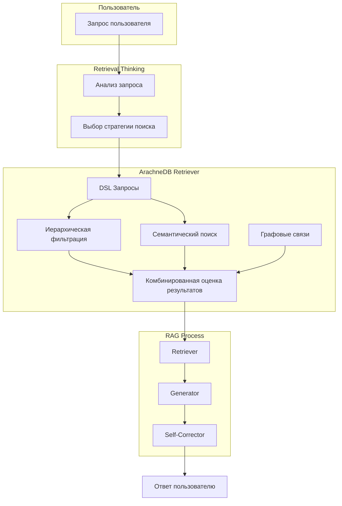

# Notarius RAG: Иерархический и графовый поиск для генеративных моделей

<div align="center">
<a href="https://ibb.co/W4vbTQNK"></a>

  <h3>Умная генеративная система на основе ArachneDB и FAISS, иерархий и графов знаний</h3>
  
  <p>
    <a href="#особенности">Особенности</a> •
    <a href="#архитектура">Архитектура</a> •
    <a href="#быстрый-старт">Быстрый старт</a> •
    <a href="#примеры-использования">Примеры</a> •
    <a href="#retrieval-thinking">Retrieval Thinking</a> •
    <a href="#сравнение-с-другими-решениями">Сравнение решений</a>
  </p>
</div>

---

## Особенности

Notarius объединяет мощь иерархических структур данных, графовых связей и retrieval thinking для создания по-настоящему интеллектуальных RAG-систем:

- 🧠 **Retrieval Thinking** — анализ запросов LLM для выбора стратегии поиска
- 📊 **Иерархический поиск** — навигация по данным с учетом их структуры и наследования
- 🔄 **Графовые связи** — использование отношений между документами
- 🔍 **Комбинированные метрики** — настраиваемый баланс между семантикой и структурой
- 🛠 **DSL-запросы** — мощный язык для фильтрации по контенту и метаданным
- 🧩 **Адаптивные стратегии** — динамическая настройка весов поиска
- 📡 **Интеграция со стеком LangChain** — легкая интеграция с существующими RAG-системами

## Архитектура

Notarius  RAG представляет собой эволюцию традиционных RAG-систем, добавляя иерархические и графовые структуры:



### Структура данных ArachneDB

ArachneDB использует иерархические тензоры с графовыми связями:

```
HierarchicalTensor:
├── data: np.ndarray             # Эмбеддинг документа
├── hierarchy_levels: List[str]   # Названия уровней иерархии
├── hierarchy_path: List[int]     # Путь в иерархии
├── metadata: Dict                # Метаданные документа
└── relations: List[Relation]     # Связи с другими тензорами
```

## Быстрый старт

### 1. Установка зависимостей

```bash

# Установка зависимостей
pip install -r requirements.txt

# Установка Ollama (если необходимо)
# Windows: https://ollama.com/download/windows
# Linux: curl -fsSL https://ollama.com/install.sh | sh
```

### 2. Подготовка модели и API ключей

```bash
# Загрузка модели Ollama
ollama pull llama3.2:3b-instruct-fp16

# Создайте файл .env в корне проекта со следующим содержанием (опционально):
# TAVILY_API_KEY=ваш_ключ
```

### 3. Запуск примера Notarius RAG

```bash
# Запуск примера с Notarius RAG Agent
python Python/Notarius_RAG_Agent.py

# Запуск веб-интерфейса
streamlit run Python/st.py
```

## Примеры использования

### Пример 1: Базовый RAG с ArachneDB

```python
from arachnedb.aracnhe import ArachneDB
from Notarius_RAG_Agent import NotariusRetriever, get_arachne_retriever

# Инициализация ArachneDB и загрузка данных
documents_data = [
    {
        "text": "Документ о графовых базах данных",
        "hierarchy_levels": ["база_данных", "графовые", "neo4j"],
        "hierarchy_path": [0, 1, 0]
    },
    # Другие документы...
]

# Получение retriever на основе ArachneDB
retriever = get_arachne_retriever(documents_data)

# Поиск документов по запросу
docs = retriever.get_relevant_documents("Как работают графовые базы данных?")

# Использование в RAG-пайплайне
from langchain_ollama import ChatOllama
llm = ChatOllama(model="llama3.2:3b-instruct-fp16")

# Генерация ответа
response = llm.generate([
    "Вопрос: Как работают графовые базы данных?\n\n"
    f"Контекст: {docs[0].page_content}\n\n"
    "Ответь на основе предоставленного контекста."
])
```

### Пример 2: Retrieval Thinking для улучшения поиска

```python
# Retrieval Thinking для анализа запроса
thinking_result = retriever._retrieval_thinking(
    "Расскажи о принципах наследования в объектно-ориентированном программировании"
)

# Результат примерно такой:
# {
#   "key_terms": ["наследование", "объектно-ориентированное программирование", "ООП", "принципы"],
#   "hierarchy_filters": {"category": "программирование", "subcategory": "ООП"},
#   "search_strategy": "hierarchy_focused"
# }

# Создание DSL-запроса на основе анализа
dsl_query = retriever._construct_dsl_query(
    "Расскажи о принципах наследования в ООП",
    thinking_result
)

# DSL-запрос:
# FIND IN main_index
# WHERE semantic_similarity(description, "Расскажи о принципах наследования в ООП") > 0.6
# AND hierarchy.category = "программирование"
# AND hierarchy.subcategory = "ООП"
# ORDER BY combined_score(0.3, 0.7)
# LIMIT 3
```

# Retrieval Thinking

## Что это и зачем нужно?

<div align="center">
  
</div>

### Процесс

1. **Анализ запроса** — LLM анализирует запрос пользователя, определяя:

   - Ключевые термины и концепции
   - Иерархические связи и фильтры
   - Оптимальную стратегию поиска

2. **Выбор стратегии** — Retriever выбирает один из подходов:

   - `semantic_focused` — акцент на семантическое сходство (α=0.9, β=0.1)
   - `hierarchy_focused` — акцент на иерархическую структуру (α=0.3, β=0.7)
   - `combined` — сбалансированный подход (α=0.7, β=0.3)

3. **Построение DSL-запроса** — Создается запрос, учитывающий результаты анализа:

   ```
   FIND IN main_index
   WHERE semantic_similarity(text, "запрос") > 0.6
   AND hierarchy.level IN ["уровень1", "уровень2"]
   ORDER BY combined_score(alpha, beta)
   ```

4. **Обратная связь** — Результаты поиска оцениваются и используются для корректировки стратегии в последующих запросах.

## Сравнение с другими решениями

| Особенность             | Notarius RAG | Стандартный RAG | Neo4j Vector Search | PGVector |
| ----------------------- | ------------- | --------------- | ------------------- | -------- |
| Семантический поиск     | ✅            | ✅              | ✅                  | ✅       |
| Иерархии данных         | ✅            | ❌              | ⚠️ (частично)       | ❌       |
| Графовые связи          | ✅            | ❌              | ✅                  | ❌       |
| Retrieval Thinking      | ✅            | ❌              | ❌                  | ❌       |
| DSL для запросов        | ✅            | ❌              | ⚠️ (Cypher)         | ❌ (SQL) |
| Комбинированные метрики | ✅            | ❌              | ⚠️ (частично)       | ❌       |
| Адаптивная настройка    | ✅            | ❌              | ❌                  | ❌       |
| Feedback Loop           | ✅            | ❌              | ❌                  | ❌       |


## Made by NeuroGhost 
